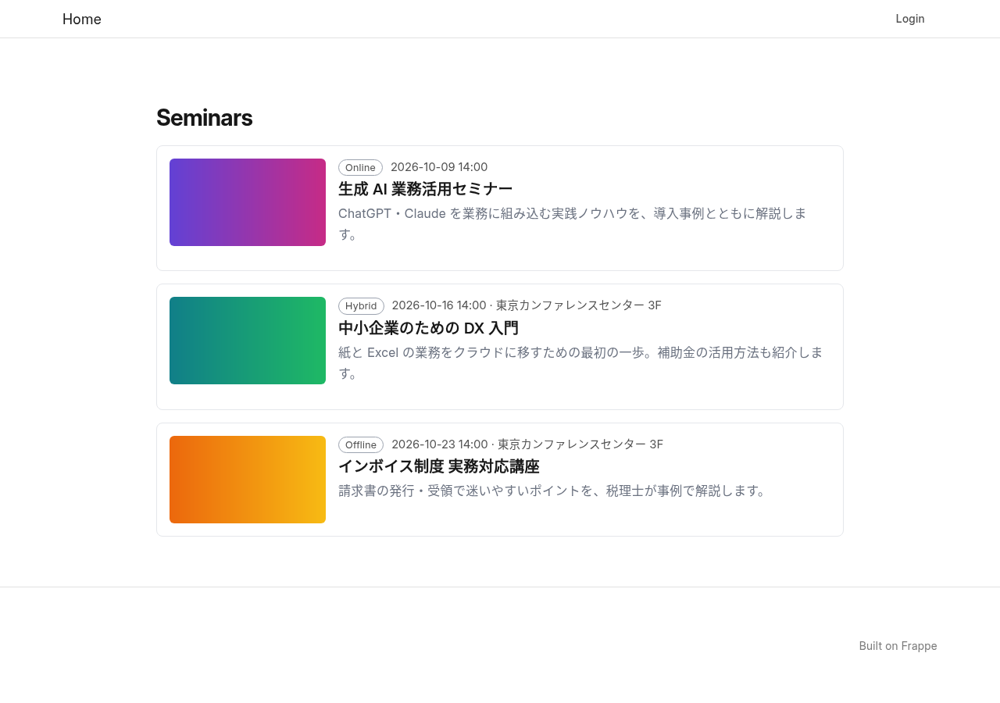
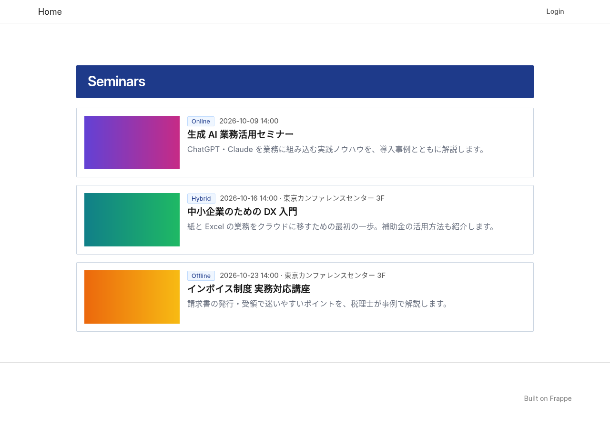
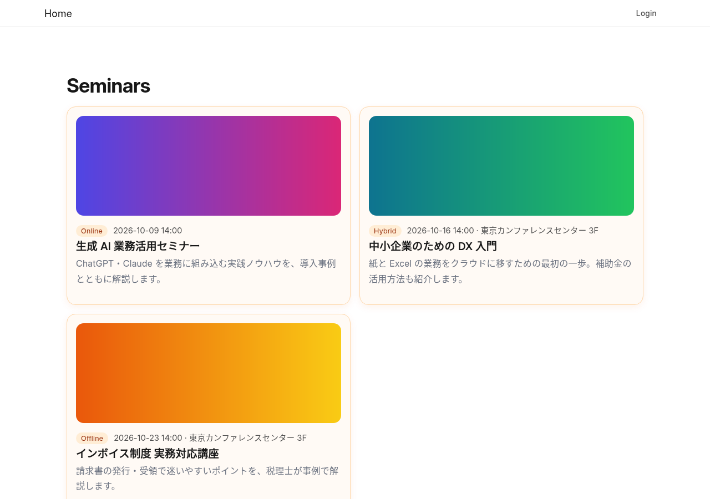
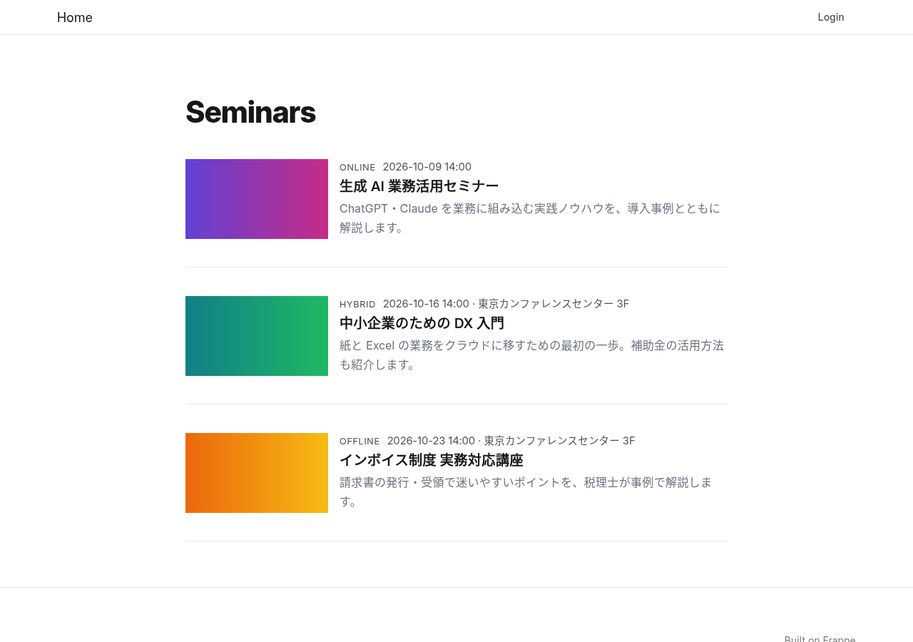
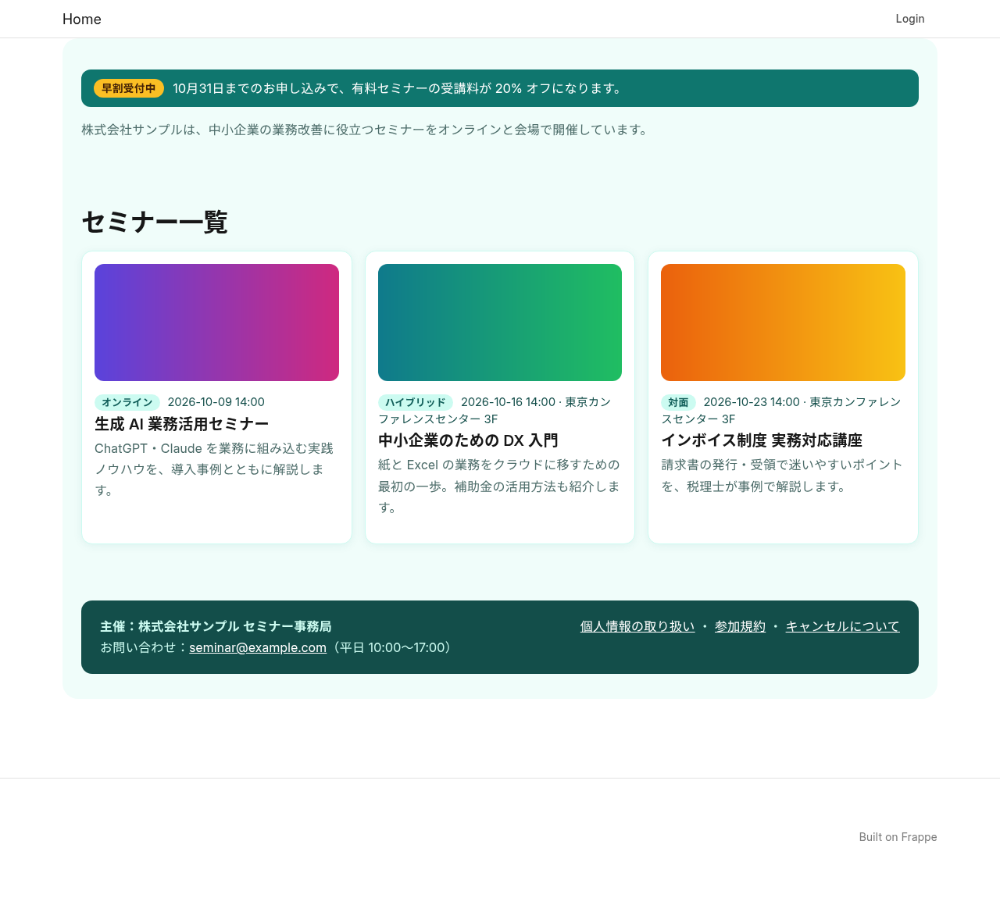
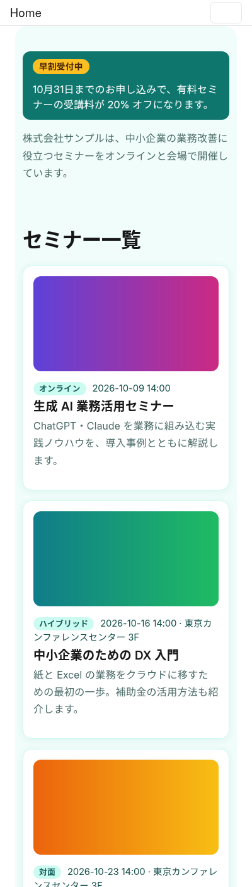
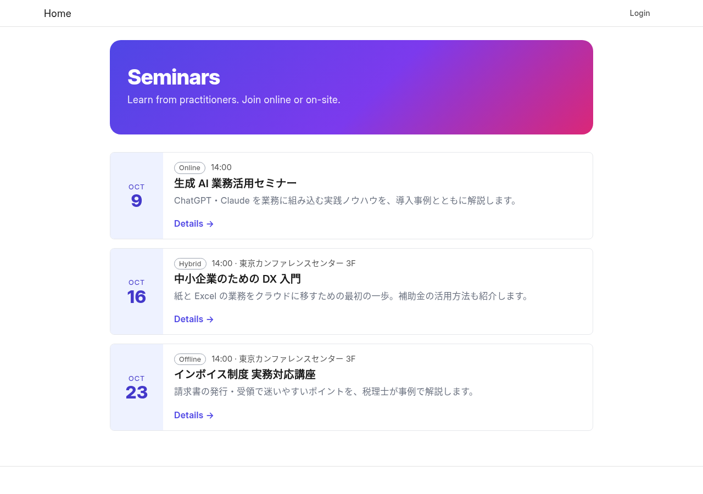
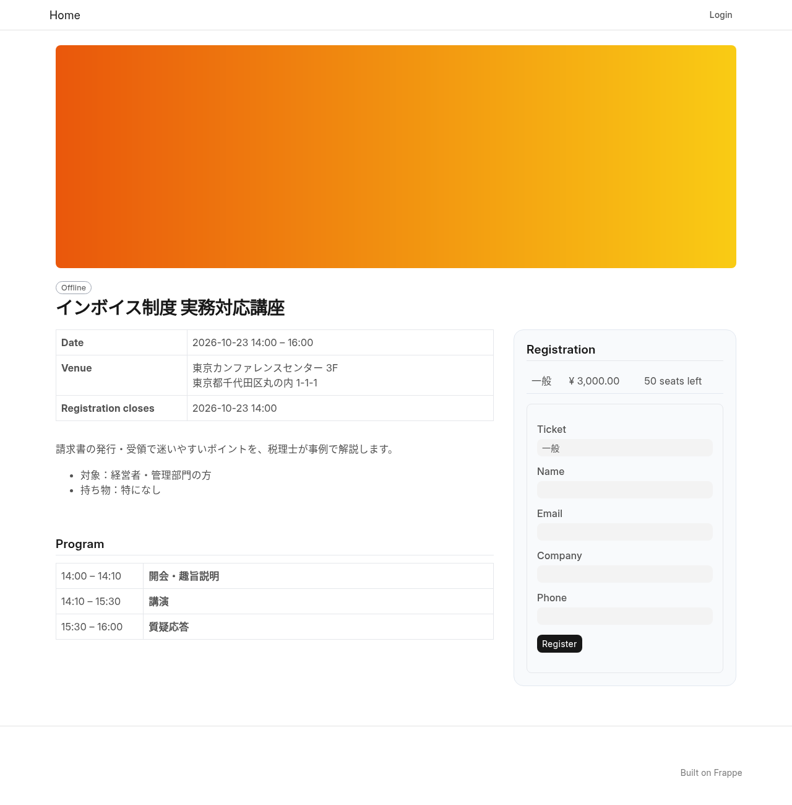

# Website Design Guide

EventMeet ─ changing the look and the layout of the public seminar pages

Applies to: EventMeet 0.2.0 or later (Frappe v15 / v16). Audience: Frappe system administrators, web designers and developers.

[日本語](../ja/website-design.md)

## 1. Overview

The public pages are `/seminars` (list), each seminar's page, the registration status page
(`/seminar-registration`) and the survey (`/seminar-feedback`). Choose the level you need:

| Level | What you change | Where | Skills |
|---|---|---|---|
| 1. Frappe website settings | Logo, navbar, footer, colours and fonts of the whole site, the home page | Website Settings, Website Theme (Frappe) | None |
| 2. EventMeet design settings | A built-in design, design tokens (colours, corners, widths, columns), extra CSS, a header and a footer around the seminar pages | Seminar Settings > Website Design | CSS (optional) |
| 3. Template override | The layout and the HTML of each page | A small Frappe app of your own | HTML / Jinja, deploying an app |

Levels can be combined: for example a built-in design with a few tokens changed, plus your logo in
Website Settings.

## 2. Frappe website settings (level 1)

Frappe's own settings, available to a System Manager without any development.

| What | Where |
|---|---|
| Show the seminar list at the site root (`/`) | Website Settings > Home > Home Page: `seminars` |
| Logo, favicon | Website Settings > Navbar > Brand Image / Brand HTML, Favicon |
| Navbar links, hide the "Login" link | Website Settings > Navbar > Top Bar Items, Hide Login |
| Footer (links, address, copyright) | Website Settings > Footer |
| Meta tags, OGP, web fonts | Website Settings > `<head>` HTML |
| Colours, Google font, button style, SCSS for the whole site | Website Theme (create one, then select it in Website Settings) |

These settings apply to the whole website, including the login page.

## 3. EventMeet design settings (level 2)

> **Screen:** **Frappe** (`https://<site>/app/seminar-settings`), section "Website Design". System Manager or Seminar Manager.

### 3.1 Built-in designs

| Design | Look |
|---|---|
| Standard | The default: neutral, follows the site's theme colours |
| Corporate | Navy, square corners, a coloured title band, wider page |
| Friendly | Warm colours, rounded cards in two columns with the image on top |
| Minimal | No boxes, large titles, thin dividers |

| Standard | Corporate |
|---|---|
|  |  |
| **Friendly** | **Minimal** |
|  |  |

### 3.2 Custom CSS and design tokens

"Custom CSS" is added after the design, so it can change the design tokens (CSS variables) or any
style. The page wrapper is `.em-page`, with the class `em-design-<design>` (for example
`em-design-friendly`).

```css
/* Brand colour, smaller corners and three columns on wide screens */
.em-page { --em-primary: #0f766e; --em-radius: 4px; --em-list-columns: 3; --em-card-direction: column; --em-card-image-width: 100%; }
```

| Token | Default (Standard) | Used for |
|---|---|---|
| `--em-primary` | the theme's primary colour | Buttons (in designs other than Standard), accents |
| `--em-on-primary` | `#fff` | Text on primary buttons |
| `--em-text` | inherit | Text colour |
| `--em-muted` | `#6b7280` | Secondary text |
| `--em-border` / `--em-border-strong` | `#e5e7eb` / `#9ca3af` | Borders / hover and badge borders |
| `--em-surface` | transparent | Background of cards and boxes |
| `--em-page-bg` | transparent | Background of the seminar area |
| `--em-radius` / `--em-badge-radius` | `8px` / `999px` | Corners of cards and boxes / of badges |
| `--em-max-width` | `880px` | Width of the content |
| `--em-title-size` / `--em-title-weight` | `1.8rem` / `700` | Page title |
| `--em-heading-size` | `1.2rem` | Card titles and section headings |
| `--em-list-columns` | `1` | Columns of the seminar list (always 1 on phones) |
| `--em-card-direction` | `row` | `row`: image beside the text, `column`: image on top |
| `--em-card-image-width` / `--em-card-image-height` | `200px` / `112px` | Size of the card image |
| `--em-shadow` | none | Shadow of cards and boxes |

The class names inside the pages (`ls-card`, `ls-title`, `ls-box`, …) can also be styled, but they may
change between versions; prefer the tokens.

### 3.3 Header and footer HTML

"Header HTML" and "Footer HTML" are shown above and below the seminar pages, for example a notice
("Early-bird price until 31 October") or links to your terms. The HTML is sanitized: `<script>`
elements and event attributes (`onclick` etc.) are removed, and it is not run as a template.

### 3.4 Example: custom CSS with header and footer

[`examples/website-design`](../../examples/website-design) has a ready-to-paste set for the Standard
design: `custom.css` (a teal brand colour, white cards on a light background, three columns with the
image on top, two on tablets and one on phones), `header.html` (an early-bird notice and an
introduction) and `footer.html` (organizer, contact address and links to the terms). The texts are in
Japanese and the company is fictitious.

| Wide screen | Phone |
|---|---|
|  |  |

Two things to keep in mind:

- Custom CSS comes after the built-in styles, including their phone layout. If you change
  `--em-list-columns` or the card layout, add your own media queries for smaller screens, as the
  example does.
- The header and footer HTML may use `class` and `style` attributes; style the classes in Custom CSS.
  Saved HTML is sanitized (Frappe v15 turns a `<script>` into plain text when the settings are
  saved; it is never run).

## 4. Template override (level 3)

To change the layout or the HTML, replace the page templates from an app of your own. EventMeet looks
up each page template through the hook `eventmeet_website_templates`; the last installed app that
sets a key wins.

```python
# hooks.py of your app
eventmeet_website_templates = {
	"seminar_list": "my_theme/templates/eventmeet/seminar_list.html",
	"seminar_detail": "my_theme/templates/eventmeet/seminar_detail.html",
}
```

Your template extends EventMeet's and overrides only the blocks it needs, so it keeps working when
EventMeet changes the parts you did not override.

```jinja

<h1>Upcoming events</h1>
```

A block can also be rendered somewhere else with `{{ self.<block>() }}`, which is how the example moves
the registration box into a sidebar.

### 4.1 Templates and blocks

| Key | Page | EventMeet template | Blocks |
|---|---|---|---|
| `seminar_list` | `/seminars` | `eventmeet/templates/eventmeet/seminar_list.html` | `em_list_header`, `em_card` (one card; variable `s`), `em_empty` |
| `seminar_detail` | seminar page | `eventmeet/templates/eventmeet/seminar_detail.html` | `em_hero`, `em_overview`, `em_description`, `em_program`, `em_speakers`, `em_registration` |
| `registration` | `/seminar-registration` | `eventmeet/templates/eventmeet/registration.html` | `em_not_found`, `em_title`, `em_status`, `em_details`, `em_join`, `em_checkin_qr`, `em_survey` |
| `feedback` | `/seminar-feedback` | `eventmeet/templates/eventmeet/feedback.html` | `em_title`, `em_form` |

All of them extend `eventmeet/templates/eventmeet/layout.html`, which has the blocks `em_styles`
(the design CSS; use `{{ super() }}` to keep it and add your own), `em_header`, `em_content` and
`em_footer`. The context variables of each page are listed at the top of its template.

> [!WARNING]
> The seminar page and the survey submit their forms with a script that looks for fixed element ids.
> If you override `em_registration` or `em_form`, keep the form ids and field names listed at the top
> of `seminar_detail.html` and `feedback.html` (for example `ls-register-form`, `ls-register-message`
> and the fields `ticket_type`, `attendee_name`, `email`, `company`, `phone`, and the hidden `website`).

### 4.2 Example app

[`examples/eventmeet_theme_example`](../../examples/eventmeet_theme_example) is a complete app that
replaces two templates: a landing-page list with a hero section and date tiles, and a two-column
seminar page with the registration box fixed on the right.

| List | Seminar page |
|---|---|
|  |  |

1. Copy the folder and rename the app (folder, package, `app_name` in `hooks.py`, `pyproject.toml`).
2. Change the templates in `<app>/templates/eventmeet/`.
3. Put the app in a Git repository and install it on the bench:

   ```bash
   bench get-app <url-of-your-repository>
   bench --site <site> install-app <your_app>
   ```

Uninstalling the app brings back EventMeet's own templates.

### 4.3 Why templates are not editable in the browser

Jinja templates run on the server. A template that could be edited in the browser would let anyone with
access to the setting run code on the server, so EventMeet only renders templates that come from
installed apps (reviewed and deployed like any other code). The settings in level 2 are plain CSS and
sanitized HTML for the same reason.
